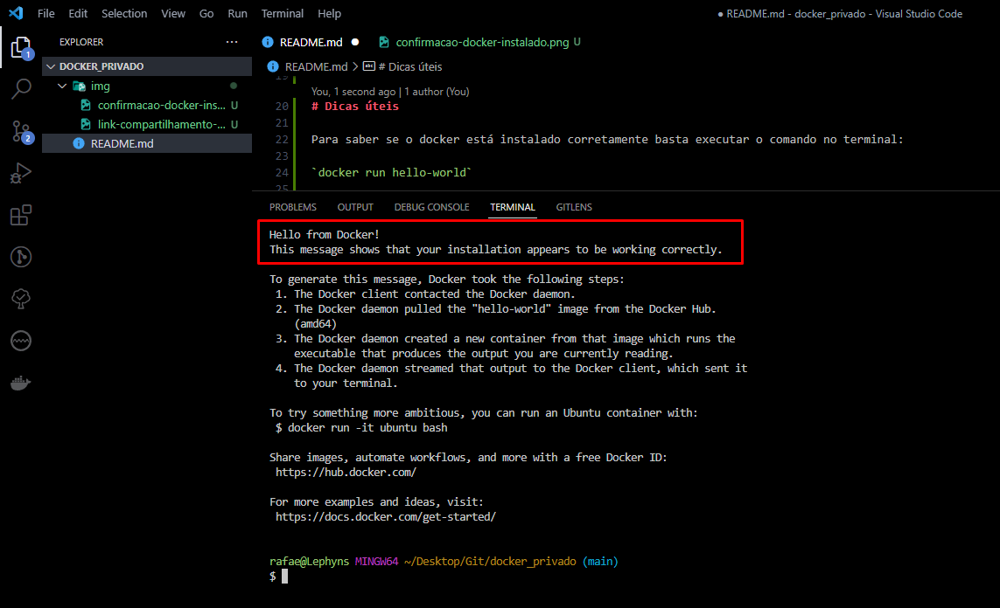

# O projeto

Projeto criado para exercitar a criação de containeres com o Docker e Docker Compose. Foi definido 3 containeres diferentes para que cada tecnologia (Phoenix, Nginx e Postgres) tenha seu próprio ambiente e sejam capazes de conversar entre si através do arquivo `docker-compose.yml`. 
Para colocar os containeres para rodar basta digitar o comando abaixo no terminal:

`$ docker-compose up -d`

O Docker irá validar o arquivo `docker-compose.yml` e irá começar a procurar as imagens que os containeres precisam para serem executados. Depois o Docker começará a criar os containeres na ordem e inicializá-los e listará os containeres que foram criados com o Docker. 
O output desse comando exibe todos os containeres que estão em execução e como foi adicionado a flag -a será exibido todos os containeres que existem na sua máquina.
Também foi adicionado a flag -d para que o terminal seja liberado após a conclusão desse comando.

# Aplicativos utilizados no projeto

* Postman;
* Docker;
* Docker compose.

# Newman, Docker e Docker Compose

O **Newman** é um executor de coleta de linha de comando para o Postman. Ele permite que você execute e teste de  Collections diretamente da linha de comando. 
O **Docker** agrupa partes de softwares de um sistema de arquivo completo e que abrange todos os recursos necessários para a sua execução. Por isso, é uma plataforma de containeres. 
O **Docker Compose** é o orquestrador de containeres da Docker (através do arquivo chamado docker-compose.yml). O arquivo docker-compose.yml é onde declaramos nossas instruções e o estado que cada container deve ser criado e operado bem como a comunicação entre eles. Em poucas paravras o Docker Compose é uma ferramenta para gerenciar containeres que tenham algum tipo de dependência entre si. Nós declaramos esses containeres e seus parâmetros em um arquivo chamado docker-compose.yml.

# Passos para criar o arquivo docker-compose e rodar os containeres

**Passo 1:** criar arquivo `docker-compose.yml` para definir 3 containeres diferentes para que cada tecnologia tenha seu próprio ambiente e sejam capazes de conversar entre si
O arquivo criado irá buildar:
    * Phoenix (um web framework feito com Elixir);
    * Um servidor web Nginx e;
    * Um banco de dados Postgres.

**Passo 2:** rodar os containeres
O comando abaixo coloca todos os 3 containers para rodar:

`$ docker-compose up -d`

Após executado será exibido todos os containers que estão em execução e como adicionamos a flag -a será exibido todos os containers que existem na sua máquina:

### Vale lembrar!
Quando criamos contêineres utilizando o docker-compose, além dos contêineres, outras entidades são criadas. Uma das mais importantes é a Network.
Na versão 2.x todos os containers de todos os arquivos `docker-compose.yml` que eram criados se juntavam em uma mesma network com nome default.
Na versão 3.x esse comportamento mudou, de modo que cada arquivo docker-compose.yml tem sua própria network. O docker-compose nomeia a network do arquivo docker-compose.yml utilizando o nome do diretório concatenado com a string _default. Portanto na versão 3.x do docker-compose a network é definida por arquivos `docker-compose.yml` e um container de fora desse arquivo, por padrão, não se comunica com os que estão definidos nele.

# Explicando o arquivo docker-compose.yml

* **version:** exibe a versão do docker-compose.
* **services:** declara 3 contêineres (app, nginx e postgres). Cada serviço é um bloco independente com as próprias declarações.
* **app:** bloco de serviço.
* **image:** utiliza uma imagem pronta, fornecida pelo Docker Hub que já possui essas tecnologias prontas para uso.
* **container_name:** apenas para definir o nome do container.
* **volumes:** essa declaração faz uma "ligação" com o diretório da sua máquina (host) com o diretório do container. Então, nós estamos "ligando" o diretório em que o docker-compose.yml está `./` com o diretório `/var/www/application/` dentro do container. Dessa forma todos os arquivos que tem em um diretório aparecerá no outro.
* **working_dir:** define que o path que passamos à ela, `/var/www/application/` seja o diretório padrão onde os comandos serão executados.
* **expose:** expõe a porta 4000 do container para que ela receba tráfego.
* **tty:** faz com que o container fique em execução em segundo plano mesmo se nenhum comando for executado.
* **nginx:** bloco de serviço.
* **ports:** porta que a aplicação irá escutar.
* **postgres:** bloco de serviço.
* **environment:** adiciona env variables ao seu container. As três variáveis que adicionamos servem para o Postgres configurar um banco de dados, usuário e senha.

# Dicas úteis

Pré-requisitos do docker compose:

* Docker Compose requer o Docker Engine;
* O plug-in do Docker Compose requer o Docker CLI.

# Comandos mais corriqueiros do Docker Compose:

* Parando todos os contêineres: 
    `$ docker-compose stop`

* Removendo todos os contêineres: 
    `$ docker-compose rm -f`

* Vendo o log de todos os contêineres: 
    `$ docker-compose logs -f`

* Construir os contêineres sem inicializá-los: 
    `$ docker-compose build`

# Passos para rodar os testes de uma coleção do Postman gerando o relatório do Newman pelo Docker

**Passo 1:** copiar link de compartilhamento dos testes de uma coleção no Postman.

**Passo 2:** abrir o docker porque ele precisa estar em execução para seguir para as proximas etapas. Para saber se o docker está instalado corretamente basta executar o comando no terminal:

`$ docker run hello-world`

A mensagem abaixo deverá ser exibida no terminal:

**Passo 3:** configurar container do Docker
No terminal, rodar o comando abaixo que irá puxar a imagem do docker newman do hub do docker:

`$ docker pull postman/newman_ubuntu1404`

Após o processo ser finalizado a imagem do postman/newman irá ser exibida no Docker:

**Passo 4:** executar comandos newman na imagem baixada
No terminal, rodar o comando abaixo:

`$ docker run -t postman/newman_ubuntu1404 run "<Seu Via JSON Link da coleção aqui>"`

Exemplo de como ficou o meu:
`$ docker run -t postman/newman_ubuntu1404 run "https://api.postman.com/collections/24641452-734ee9f4-3e94-40fd-a64b-ddf7fa88e3a6?access_key=PMAT-01GP4GH6BFFHP3798GA9TGM99Y"`

Após o comando ser finalizado será exibido o relatório de testes do newman:

